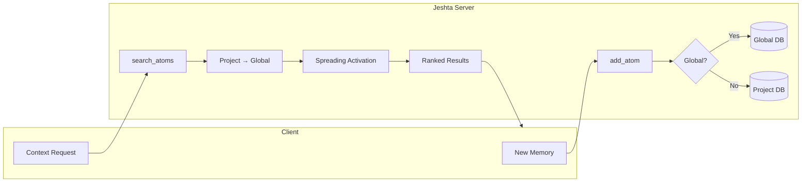

# Jeshta (ज्येष्ठा)

<p align="center">
  
</p>

> *"I hold your memories so they never fade away~"* — **Jeshta** ✨

[](https://opensource.org/licenses/MIT)
[](https://www.python.org/downloads/)
[](https://github.com/modelcontextprotocol)

> **Persistent, intelligent memory for Agentic AI.**

**Jeshta** is a local-first MCP server that gives LLMs true long-term memory. Featuring custom algorithms for binary quantization, spreading activation, topological delta resolution, and Ebbinghaus-inspired forgetting curves — all without heavy dependencies.

## ✨ Key Features

| Feature | Description |
|---------|-------------|
| 🧠 **Multi-Scope Memory** | Global preferences persist across ALL projects; project memories stay isolated |
| 🔄 **Forgetting Curve** | Ebbinghaus-inspired decay — unused memories fade, accessed ones strengthen |
| 🌐 **Spreading Activation** | Search for "Login" also activates "Authentication" and "Sessions" |
| 📊 **Hierarchical Search** | Project scope first, global fallback — with priority weighting |
| 🛡️ **Causal Integrity** | Detects temporal paradoxes and graph corruption |
| ✨ **Dreaming** | Consolidates similar memories into optimized archetypes |
| 🔌 **Zero Dependencies** | Just Python + NumPy. Local-first, no cloud required |

## 🛠️ 6 Essential Tools

Jeshta exposes only what you need — no bloat:

| Tool | Purpose |
|------|---------|
| `add_atom` | Save a memory (auto-detects global vs project) |
| `search_atoms` | Recall memories (hierarchical: project → global) |
| `compile_context` | Initialize session with merged context |
| `delete_atom` | Explicitly forget something |
| `recall_related` | Explore memory relationships |
| `verify_integrity` | Self-check for paradoxes |

## 🏗️ Architecture



## 🚀 Quick Start

### Installation
```bash
pip install numpy fastembed
```

### Running
```bash
python server.py
```

### Integration (Claude Desktop)
Add to `%APPDATA%\Claude\claude_desktop_config.json`:
```json
{
  "mcpServers": {
    "jeshta": {
      "command": "python",
      "args": ["D:\\brain\\buddi\\server.py"]
    }
  }
}
```

## 🧬 How Memory Works

### Scope Hierarchy
```
User: "I always prefer dark mode"
→ Auto-detected as GLOBAL (keyword: "always")
→ Persists across ALL projects

User: "This project uses GraphQL"  
→ Saved to PROJECT scope
→ Only available in this workspace
```

### Forgetting Curve
```
Retention = e^(-t/S)

t = days since last access
S = stability (grows with access count)

Frequently accessed → Strong retention
Never accessed → Gradually forgotten
```

---

<p align="center">
  <strong>Jeshta</strong> — Memory that learns, forgets, and remembers what matters.
  <br>
  Built with ❤️ for the Agentic Future.
</p>
