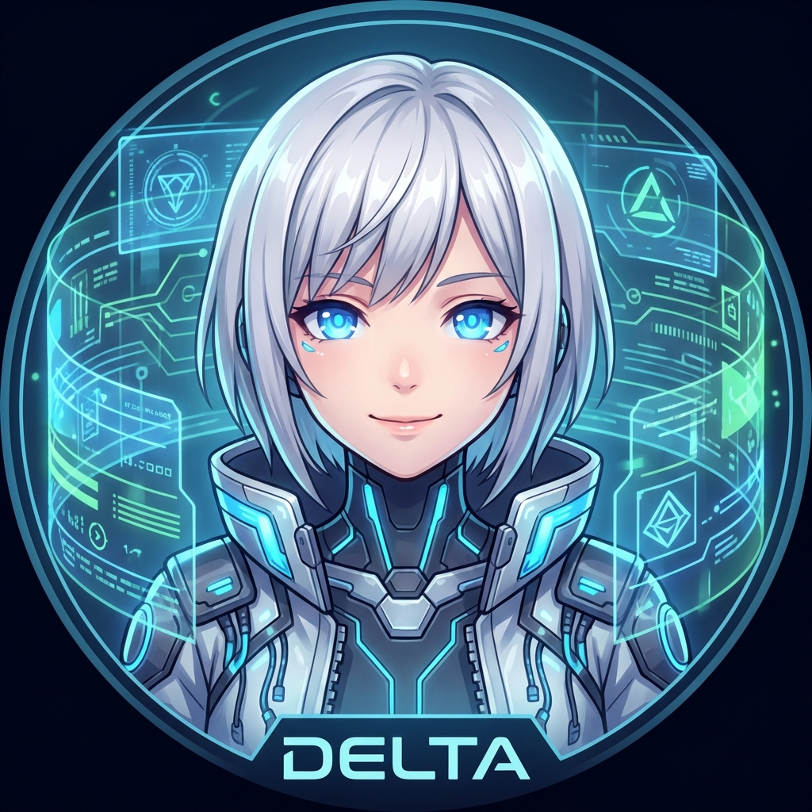
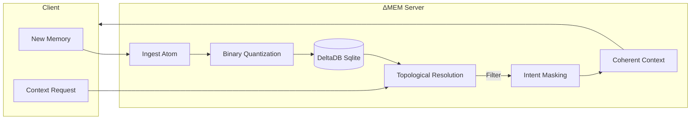

# ΔMEM (Delta Memory)

<p align="center">
  
</p>

> *"I remember everything, so you don't have to."* — **Delta** (Your Cybernetic Memory Guardian)

[](https://opensource.org/licenses/MIT)
[](https://www.python.org/downloads/)
[](https://github.com/modelcontextprotocol)
[](https://martinfowler.com/eaaDev/EventSourcing.html)

> **The deterministic, event-sourced memory engine for Agentic AI.**

**ΔMEM** is a production-grade, local-first Model Context Protocol (MCP) server designed to give LLMs a reliable, evolving long-term memory. Unlike simple vector stores, ΔMEM uses a custom **Topological Delta Resolution** algorithm to handle state changes, ensuring your AI never gets confused by outdated facts.

## 🌟 Why ΔMEM?

| Feature | Description |
| :--- | :--- |
| **🧠 Zero Hallucinations** | Uses a deterministic specific-to-general resolution graph. No fuzzy math for critical state. |
| **⏳ Time Travel** | Built on an append-only Event Sourcing architecture. Replay history or roll back state instantly. |
| **⚡ High Performance** | Custom bitwise Hamming distance acceleration for vector search. <15ms retrieval latency. |
| **🛡️ Pure & Simple** | Zero heavy dependencies. No LangChain, no Pydantic, no cloud lock-in. 100% Python. |

## 🏗️ Architecture

ΔMEM ingests "Atoms" of memory, stores them in an immutable ledger, and resolves them into a coherent "Context" at runtime.



## 🚀 Quick Start

### Prerequisites
- Python 3.10+
- `numpy` (for vector math)

### Installation
Clone the repository and install dependencies (just numpy!):
```bash
pip install numpy
```

### Running the Server
Start the MCP server to listen on stdio (compatible with Claude Desktop, Cursor, etc.):
```bash
python server.py
```

### 🔌 Integration (Cline / Antigravity)

Add this to your MCP settings file (e.g., `%APPDATA%/Code/User/globalStorage/saoudrizwan.claude-dev/settings/cline_mcp_settings.json` or similar):

```json
{
  "mcpServers": {
    "delta-mem": {
      "command": "python",
      "args": ["<ABSOLUTE_PATH_TO_REPO>/buddi/server.py"]
    }
  }
}
```
> **Note**: Replace `<ABSOLUTE_PATH_TO_REPO>` with the actual path to where you cloned this repo.

### Client Usage Example
Here is how you can interact with ΔMEM programmatically:

```python
# See example_client.py for full code
import subprocess
# ... setup RPC connection ...

# 1. Add a Fact
rpc_request(process, "tools/call", {
    "name": "add_atom",
    "arguments": {
        "content": "User prefers Dark Mode.",
        "embedding": [0.1, 0.9, ...], # Your embedding vector
        "intent_mask": 1, # Fact
        "scope_hash": "user_settings"
    }
})

# 2. Add a Delta (Change)
rpc_request(process, "tools/call", {
    "name": "add_atom",
    "arguments": {
        "content": "User switched to Light Mode.",
        "embedding": [0.1, 0.92, ...],
        "intent_mask": 2, # Delta
        "scope_hash": "user_settings",
        "refs": ["<id_of_previous_fact>"] # Explicit reference
    }
})

# 3. Get Current State
context = rpc_request(process, "tools/call", {
    "name": "compile_context",
    "arguments": { "scope_hash": "user_settings" }
})
# Result: "User switched to Light Mode" (Old fact is superceded)
```

## 🛠️ MCP Tool Reference

ΔMEM exposes the following tools via the Model Context Protocol:

| Tool Name | Description | Key Arguments |
| :--- | :--- | :--- |
| `add_atom` | Ingest a new memory atom (Fact, Delta, or Constraint). | `content`, `embedding`, `intent_mask`, `refs` |
| `search_atoms` | Semantic search with hardware-accelerated bitwise filtering. | `embedding`, `intent_mask`, `top_k` |
| `compile_context` | ⭐️ **Core Feature**. Resolves the delta graph to return the current "Truth". | `scope_hash` |
| `diff_memory` | Compare two atoms to understand divergence. | `id_a`, `id_b` |
| `compact_scope` | "Squash" history into a fresh snapshot for efficiency. | `scope_hash` |
| `prune_expired_atoms`| Cleanup routine for TTL-expired memories. | None |

## 🤖 AI Integration

To teach your AI agent how to use this memory effectively, please refer to the [**AI Instructions**](./AI_INSTRUCTIONS.md). This document contains the system prompt and usage patterns optimized for LLMs.

---

<p align="center">
  Built with ❤️ for the Agentic Future.
</p>
