# ΔMEM (Delta Memory)

<p align="center">
  
</p>

> *"I remember everything, so you don't have to."* — **Delta** (Your Cybernetic Memory Guardian)

[](https://opensource.org/licenses/MIT)
[](https://www.python.org/downloads/)
[](https://github.com/modelcontextprotocol)
[](https://martinfowler.com/eaaDev/EventSourcing.html)

> **The deterministic, event-sourced memory engine for Agentic AI.**

**ΔMEM** is a production-grade, local-first Model Context Protocol (MCP) server designed to give LLMs a reliable, evolving long-term memory. Unlike simple vector stores, ΔMEM uses a custom **Topological Delta Resolution** algorithm to handle state changes, ensuring your AI never gets confused by outdated facts.

## 🌟 Why ΔMEM is Better

We aren't just another vector DB wrapper. Here is how we stack up against the competition:

| Feature | ΔMEM (This Project) | Mem0 | ByteRover |
| :--- | :--- | :--- | :--- |
| **🧠 Intelligence** | **Spreading Activation**: Searches activate related concepts via graph traversal (2-hop). | Semantic Search Only | Semantic Search Only |
| **🛡️ Reliability** | **Causal Integrity Check**: Deterministic validation of timeline paradoxes. prevents corruption. | Probabilistic | Standard DB Constraints |
| **✨ Originality** | **Centroid Consolidation ("Dreaming")**: Merges similar memories into optimized archetypes. | Append-only (bloats over time) | Append-only |
| **🔌 Protocol** | **Native MCP Support** (Resources & Prompts) | API / SDK | API / SDK |
| **📦 Deployment** | **Zero Dependencies** (Python + SQLite). Local First. | Cloud / Complex Deps | Cloud / Complex Deps |

## 🚀 New Cognitive Features (v2.0)

### 1. 🧠 Intelligent: Spreading Activation
Memory is associative. When you search for "Login", ΔMEM also faintly activates "Authentication" and "User Profile" if they are linked in the graph, even if the vector similarity is low. This provides **context-aware retrieval**.

### 2. 🛡️ Reliable: Causal Integrity
Trust is paramount. The new `verify_integrity` tool scans your memory graph for **Temporal Paradoxes** (e.g., a child node created before its parent) and **Dangling References**, ensuring your agent's worldview is always logically consistent.

### 3. ✨ Original: Centroid Consolidation ("Dreaming")
Over time, memories get repetitive. ΔMEM runs a background "dreaming" process that finds clusters of highly similar memories (>95% overlap) and merges them into a single **Centroid Atom**, reducing noise and improving retrieval speed.

## 🏗️ Architecture

ΔMEM ingests "Atoms" of memory, stores them in an immutable ledger, and resolves them into a coherent "Context" at runtime.

```mermaid
flowchart LR
    subgraph Client
        Input[New Memory]
        Query[Context Request]
    end

    subgraph "ΔMEM Server"
        direction TB
        Ingest[Ingest Atom] --> Quantize[Binary Quantization]
        Quantize --> DB[(DeltaDB Sqlite)]
        
        DB --> Resolve[Topological Resolution]
        Resolve --> |Filter| Intent[Intent Masking]
        Intent --> Context[Coherent Context]
    end

    Input --> Ingest
    Query --> Resolve
    Context --> Client
```



## 🛠️ MCP Integration

ΔMEM is a fully compliant MCP server implementing **Tools**, **Resources**, and **Prompts**.

### Tools (Function Calls)
| Tool Name | Description | Key Arguments |
| :--- | :--- | :--- |
| `add_atom` | Ingest a new memory atom (Fact, Delta, or Constraint). | `content`, `embedding`, `intent_mask`, `refs` |
| `search_atoms` | Semantic search with **Spreading Activation**. | `embedding`, `intent_mask`, `top_k`, `use_spreading_activation` |
| `verify_integrity` | 🛡️ Check for graph paradoxes and corruption. | `scope_hash` |
| `consolidate_memory` | ✨ Cluster and merge similar memories ("Dreaming"). | `scope_hash`, `similarity_threshold` |
| `compile_context` | ⭐️ Resolves the delta graph to return the current "Truth". | `scope_hash` |

### Resources (Data Access)
| URI | Description |
| :--- | :--- |
| `mem://stats` | View live memory statistics (count, active scope). |
| `mem://atom/{id}` | Inspect raw data of a specific memory atom. |

### Prompts (Workflows)
| Prompt Name | Description |
| :--- | :--- |
| `recall_context` | Guide the AI to search and compile context for a task. |
| `save_decision` | Standardized template for logging architectural decisions. |

## 🚀 Quick Start

### Installation
Clone the repository and install dependencies (just `numpy` and `fastembed` for auto-embedding):
```bash
pip install numpy fastembed
```

### Running the Server
Start the MCP server to listen on stdio (compatible with Claude Desktop, Cursor, etc.):
```bash
python server.py
```

### 🔌 Integration (Cline / Antigravity)

Add this to your MCP settings file:

```json
{
  "mcpServers": {
    "delta-mem": {
      "command": "python",
      "args": ["<ABSOLUTE_PATH_TO_REPO>/delta/server.py"]
    }
  }
}
```

---

<p align="center">
  Built with ❤️ for the Agentic Future.
</p>
